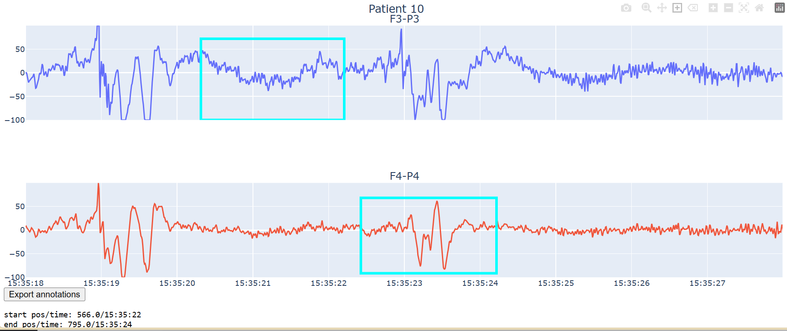

# [EEG annotation website](https://labeleeg-unb5daapya-de.a.run.app/)

- 輸入長、寬、Pixelperinch
- 分別上傳EEG txt檔案(五分鐘)
- 按下enter
- 等待10~15秒顯示訊號
- 訊號右上角有功能列
  - pan 左右移動
  - draw rect 標註癲癇區域
  - erase 是取消標註
- 標註完成按紐export annotation輸出標註檔案
